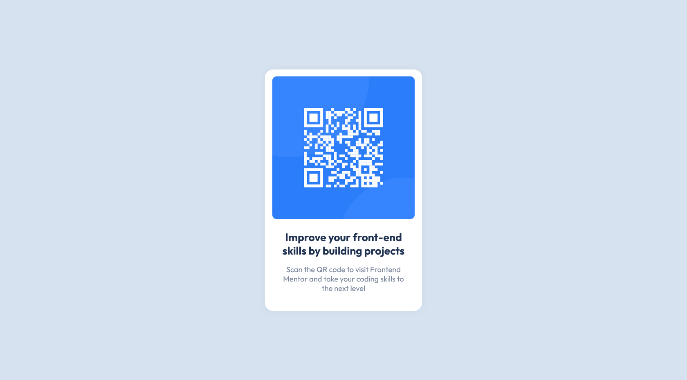

# Frontend Mentor - QR code component solution

This is a solution to the [QR code component challenge on Frontend Mentor](https://www.frontendmentor.io/challenges/qr-code-component-iux_sIO_H).

## Table of contents

- [Overview](#overview)
  - [Screenshot](#screenshot)
  - [Links](#links)
- [My process](#my-process)
  - [Built with](#built-with)
  - [What I learned](#what-i-learned)
- [Author](#author)

## Overview

### Screenshot

### Links

- Live Site URL: [GitHub Pages](https://daugus.github.io/fm-qr-code-component/)

## My process

### Built with

- Sass

### What I learned

- Sass basics

## Author

<!-- - Website - [daugus](https://dlcde.ml) -->

- Frontend Mentor - [@daugus](https://www.frontendmentor.io/profile/daugus)
